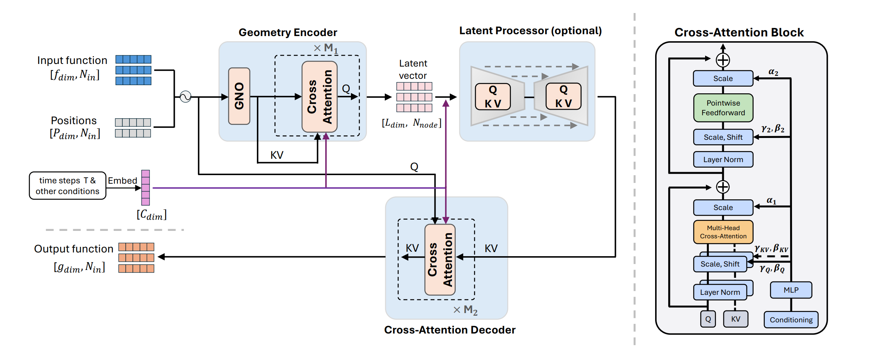
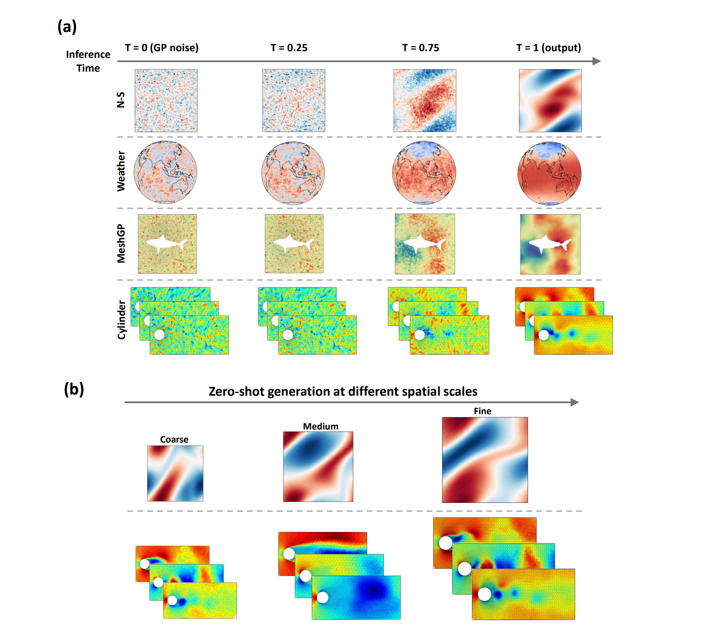

# Mesh-Informed Neural Operator : A Transformer Generative Approach


### [MINO Paper](https://www.arxiv.org/abs/2506.16656) 
by Yaozhong Shi, Zachary E. Ross, Domniki Asimaki, Kamyar Azizzadenesheli

## Model architecture


## Inference and zero-shot generation


## Setup and tutorials
First download the processed dataset from [https://huggingface.co/datasets/Yaozhong/MINO](https://huggingface.co/datasets/Yaozhong/MINO), unzip it and place all files in the ``dataset`` folder 

To set up the environment, create a conda environment

```
# clone project
git clone https://github.com/yzshi5/MINO.git
cd MINO

# create conda environment
conda env create -f environment.yml

# Activate the `mino` environment
conda activate mino
```


Install the `ipykernel` to run the code in a jupyter notebook
```
conda install -c anaconda ipykernel

pip install ipykernel

python -m ipykernel install --user --name=mino
```

`tutorials` contains three representative experiments 

## Run training scripts
active the conda envs in the terminal, then go to the (unzip) project folder
```
conda activate mino
cd MINO
```

Training scripts for all experiments are available under `scripts` folder. To run the Navier-Stokes experiments for MINO-T, simply run 
```
bash scripts/NS_MINO_T.sh
```
Set `eval` as 1 for inference only, check `exp` folder for more details, 

The unconditional version for PDE solving will be released in two days

## Acknowledgement
Special thanks to the following GitHub repositories for their valuable datasets:

https://github.com/neuraloperator/neuraloperator

https://github.com/pdebench/PDEBench

https://github.com/computational-imaging/GraphPDE

https://github.com/EmilienDupont/neural-function-distributions

https://catalog.ngc.nvidia.com/orgs/nvidia/teams/modulus/resources/modulus_datasets_cylinder-flow
## Reference
```bibtex
@article{shi2025mesh,
  title={Mesh-Informed Neural Operator: A Transformer Generative Approach},
  author={Shi, Yaozhong and Ross, Zachary E and Asimaki, Domniki and Azizzadenesheli, Kamyar},
  journal={arXiv preprint arXiv:2506.16656},
  year={2025}
}


