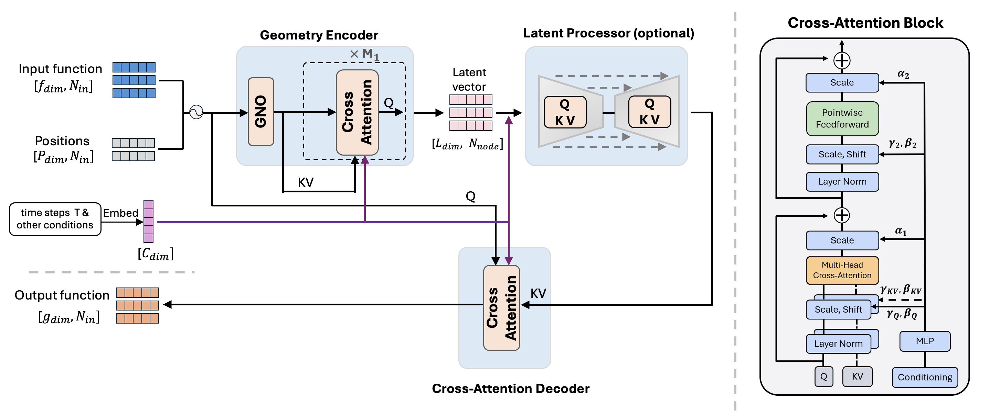

# Mesh-Informed Neural Operator : A Transformer Generative Approach

### [MINO Paper](https://www.arxiv.org/abs/2506.16656) 
by Yaozhong Shi, Zachary E. Ross, Domniki Asimaki, Kamyar Azizzadenesheli

## Model architecture

## Inference and zero-shot generation

## Setup
First download the processed dataset from [https://huggingface.co/datasets/Yaozhong/MINO](https://huggingface.co/datasets/Yaozhong/MINO), unzip it and place all files in the dataset folder 

## Usage
placeholder
